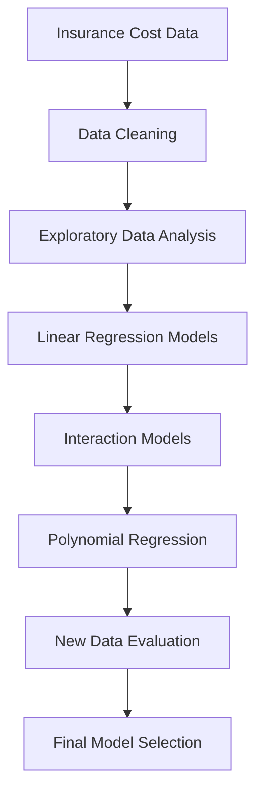
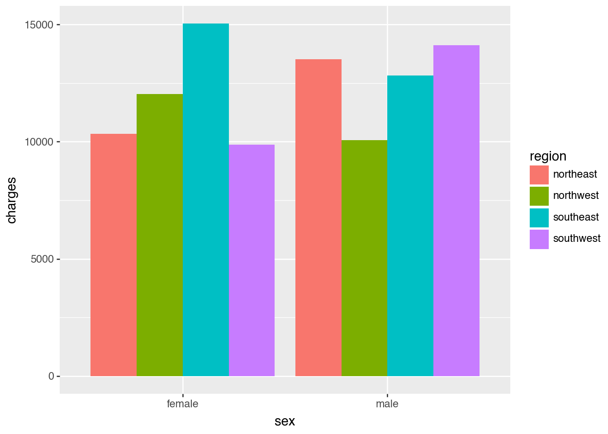

# Insurance Cost Analysis


---

## Overview

This project analyzes medical insurance charges using demographic and health-related variables. The main goal is to understand which factors are most strongly associated with insurance costs and to compare regression models that can predict charges on new data.

The analysis starts with exploratory visualizations, then compares simple linear regression, multiple linear regression, interaction models, and polynomial regression. I evaluate model performance using mean squared error (MSE) and R-squared because this is a regression problem and prediction error matters.

---

## Project Workflow



---

## Business Problem

Insurance charges can vary widely across individuals. Understanding the factors that contribute to higher medical costs can help explain pricing patterns and improve prediction for future policyholders.

This project focuses on questions such as:

- How do age, BMI, smoker status, sex, and region relate to insurance charges?
- Which variables add the most predictive value?
- Do interaction terms or polynomial terms improve model performance?
- Which model performs best when evaluated on a second insurance dataset?

---

## Dataset

The project uses two insurance cost datasets:

- `insurance_costs_1.csv`
- `insurance_costs_2.csv`

The main variables include:

- `age`
- `sex`
- `bmi`
- `smoker`
- `region`
- `charges`

### Target Variable

- `charges`

This is a supervised regression problem because the goal is to predict a continuous insurance cost value.

---

## Exploratory Data Analysis

The exploratory analysis uses visualizations to identify patterns before fitting models.

### Visual Methods Used

- Boxplot of charges by smoker status
- Side-by-side bar chart of average charges by sex and region
- Scatterplot of BMI and charges by sex

### Key Insights

- Smoker status is strongly associated with higher insurance charges.
- BMI has a positive relationship with insurance charges.
- Regional and sex-based differences are visible, but they are weaker than the smoker effect.
- The scatterplots suggest mostly linear relationships, which supports starting with linear regression before testing polynomial models.




---

## Modeling Approach

The notebook compares several regression approaches:

- Simple linear regression using age
- Multiple linear regression using age and sex
- Multiple linear regression using age and smoker status
- Multiple linear regression using age and BMI
- Polynomial regression using age
- Interaction models using age, BMI, and smoker status
- Final polynomial comparison on new data

I used MSE as the primary model selection metric because it measures squared prediction error. Larger errors are penalized more heavily, which is useful when predicting dollar charges. I also used R-squared to describe how much variation in charges the model explains.

---

## Model Performance

### Early Model Comparison

The simple age-only model had limited predictive strength:

- MSE: about `126,940,631`
- R-squared: about `0.098`

Adding BMI modestly improved the model:

- MSE: about `123,981,358`
- R-squared: about `0.119`

Adding smoker status created a much larger improvement:

- MSE: about `33,795,894`
- R-squared: about `0.760`

This showed that smoker status was one of the strongest predictors of insurance charges.

### New Data Evaluation

The strongest linear/interaction model was the main effects plus smoker interactions model:

- Model: `(age + bmi) * smoker`
- MSE on new data: about `21,644,076`
- R-squared on new data: about `0.860`

The final polynomial comparison found that the degree 2 model performed slightly better:

- Best polynomial degree: `2`
- MSE: about `21,550,540`
- R-squared: about `0.861`

Based on MSE, I would choose the degree 2 polynomial model because it produced the lowest prediction error on the new data while still keeping the model reasonably simple.

---

## Final Interpretation

The analysis shows that insurance charges are not explained well by age alone. BMI adds some predictive value, but smoker status is the largest driver of model improvement. Interaction terms also help because the relationship between age, BMI, and charges changes depending on smoker status.

---

## Technologies Used

- Python
- pandas
- NumPy
- scikit-learn
- plotnine
- Jupyter Notebook

---

## Files

```text
compare/
|-- insurance_cost_analysis.ipynb
|-- insurance_costs_analysis.html
|-- README.md
|-- insurance_costs_1.csv
|-- insurance_costs_2.csv
|-- readme_assets/
    |-- lab5_insurance_costs_preview_1.png
    |-- lab5_insurance_costs_preview_2.png
```

---

## How to Run

1. Open `insurance_cost_analysis.ipynb` in Jupyter Notebook.
2. Make sure `insurance_costs_1.csv` and `insurance_costs_2.csv` are in the same folder as the notebook.
3. Run the notebook cells in order.

---

## Future Improvements

- Test additional regression methods such as ridge regression or random forest regression.
- Add cross-validation for the final model comparison.
- Explore whether outlier handling improves prediction error.
- Add a small prediction interface for estimating charges from user-provided values.


