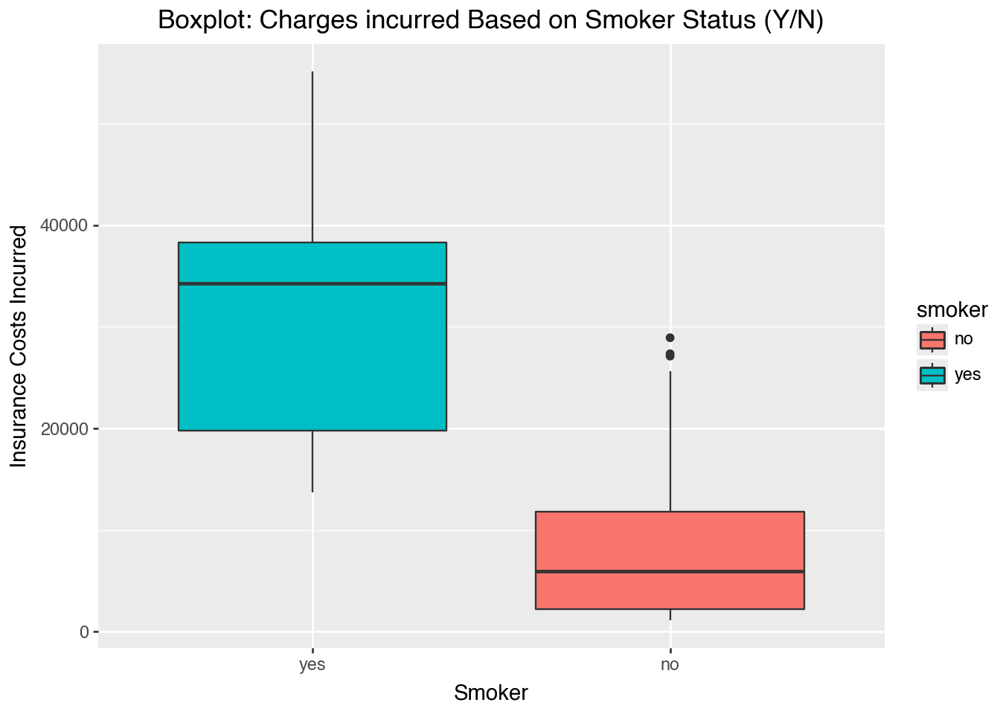

# Insurance Costs Analysis

A regression workflow for understanding insurance charges and comparing linear model specifications.

## Files

- Notebook: `lab5_insurance_costs.ipynb`
- HTML export: `lab5_insurance_costs.html`
- README: `lab5_insurance_costs_README.md`

## Data Source

insurance_costs_1.csv from https://www.dropbox.com/s/bocjjyo1ehr5auz/insurance_costs_1.csv?dl=1
insurance_costs_2.csv in repository

## Data Science Workflow

1. Load and inspect the insurance data.
2. Clean missing values and duplicates.
3. Explore charge patterns across smoker status, sex, region, BMI, and age.
4. Fit simple and multiple linear regression models, including smoker interaction terms.
5. Compare polynomial alternatives to check whether a nonlinear age relationship improves fit.
6. Evaluate the candidate models on a second insurance dataset to compare how they generalize.
7. Review residual diagnostics for the final model.
8. Select the most useful model based on MSE and R-squared on the new data.

## Models and Visual Methods Used

- Data inspection with `describe()`, missing-value checks, and duplicate removal
- Boxplot of insurance charges by smoker status
- Side-by-side bar chart of average charges by sex and region
- Scatterplot of BMI and charges by sex
- Simple linear regression
- Multiple linear regression with smoker interaction terms
- Polynomial regression with degree 2, 4, and 12
- Evaluation on a held-out second insurance dataset
- Residual diagnostics for the final model
- Model comparison with MSE and R-squared

## Visual Preview

